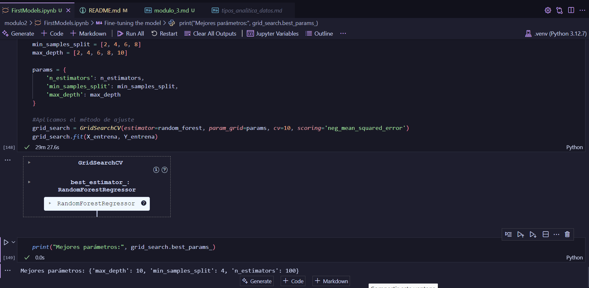

# Machine Learning

En este módulo se aabordaron los siguientes temas:
- Machine Learning
- Regresión Lineal
- Random Forest
- Desición Trees

# Parte 1: Machine Learning

En la primera parte fue todo introductorio, se hicieron pequeños ejercicios de  regresión lineal y se explicaron los conceptos básicos de Machine Learning.

# Parte 2: Modelos

En la segunda parte se abordaron los modelos de Random Forest y Desición Trees, ademas  se conocio todo el flujo que interviene en la creación de un modelo de Machine Learning.

Ademas se uso la libreria de `sklearn` para la creación de los modelos.

El trabajo final se  puede encontrar  en el notebook, en el archivo FirstModels.ipynb

